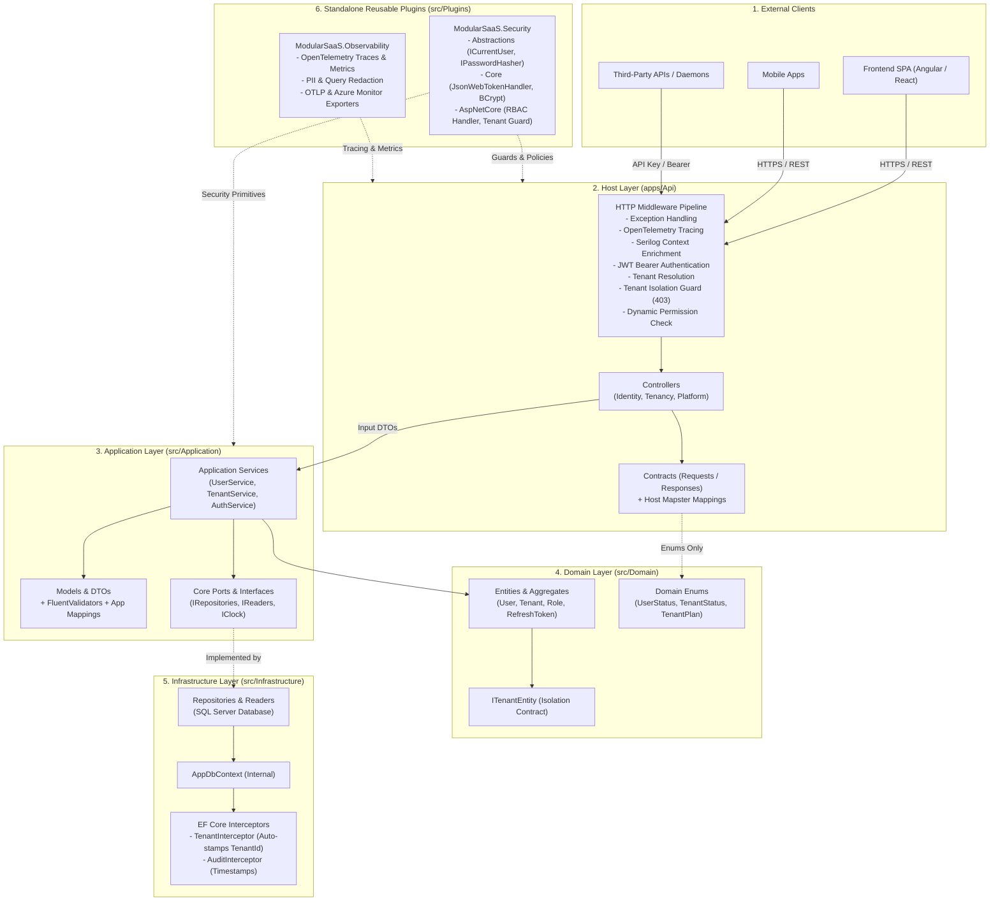
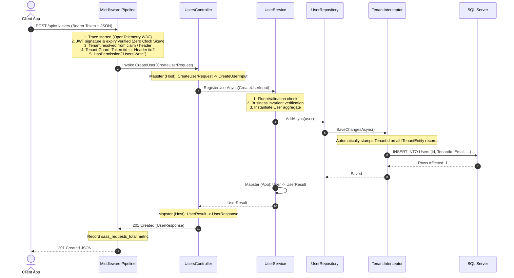
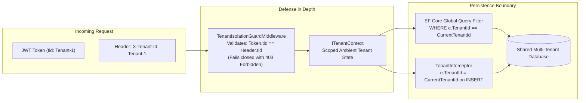
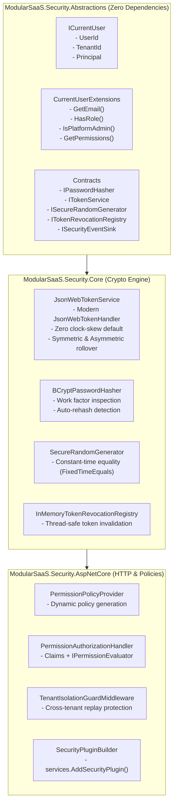
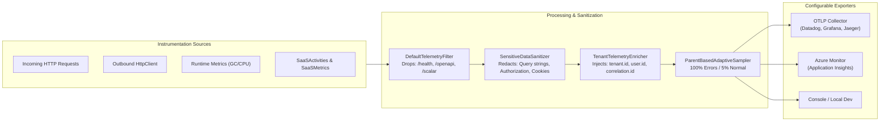

# ModularSaaS Architecture & System Design Guide

This document provides a visual and structural reference of the ModularSaaS template architecture. It is designed to be shared with technical leads, architects, and engineering teams.

---

## 1. High-Level System Architecture

The system follows **Clean Architecture** organized with **modular vertical folders** and **isolated pluggable capability libraries**.

---

## 2. Request Lifecycle & Security Barrier Sequence

This sequence illustrates how a write request traverses the pipeline, undergoes multi-tenant validation, passes business rules, and is persisted with automatic tenant isolation.

---

## 3. Multi-Tenant Data Isolation Architecture

Data isolation is enforced at the database and query pipeline level to prevent cross-tenant data leaks.

---

## 4. Standalone Security Plugin Suite (`src/Plugins/Security`)

The security subsystem is decoupled from domain aggregates into three composable libraries packageable as NuGet packages.

---

## 5. OpenTelemetry Observability Pipeline (`src/Plugins/Observability`)

Observability is vendor-agnostic and built on open standards, supporting Azure Monitor, Datadog, Grafana/Prometheus, or Jaeger via OTLP.

---

## 6. Two-Hop Mapping & CQRS Separation

To prevent entity leakages and keep query paths fast, the system uses two separate mappings and segregates read paths from write repositories.

```mermaid
flowchart TD
    subgraph WritePath["Write / Command Path"]
        WriteReq["CreateUserRequest (Host Contract)"]
        WriteMap1["Host Mapster"]
        WriteInput["CreateUserInput (App Model)"]
        WriteSvc["UserService (App Service)"]
        WriteRepo["UserRepository (Write Repository)"]
        WriteEntity["User Entity (Domain)"]

        WriteReq --> WriteMap1 --> WriteInput --> WriteSvc --> WriteRepo --> WriteEntity
    end

    subgraph ReadPath["Read / Query Path (CQRS Reader)"]
        ReadReq["GetUsersRequest (Host Contract)"]
        ReadMap1["Host Mapster"]
        ReadSvc["UserQueryService"]
        Reader["IIdentityReader (Direct Projection)"]
        ReadResult["UserListItem (Read Model)"]
        ReadMap2["Host Mapster"]
        ReadResp["UserListItemResponse (Host Contract)"]

        ReadReq --> ReadMap1 --> ReadSvc --> Reader --> ReadResult --> ReadMap2 --> ReadResp
    end
```

---

## 7. What Goes Where Reference Guide

| Layer | Path | What Goes Here | What NEVER Goes Here |
|---|---|---|---|
| **Domain** | `src/Domain/` | Entities, Domain Events, Domain Enums, `ITenantEntity`. | No EF Core, no Mapster, no ASP.NET, no repositories. |
| **Application** | `src/Application/` | Services, Use Cases, Ports/Interfaces, DTOs, FluentValidators, Application Mappings. | No SQL queries, no `AppDbContext`, no HTTP Controllers. |
| **Infrastructure** | `src/Infrastructure/` | Internal `AppDbContext`, Repositories, Readers, Interceptors, Migrations. | No business validation rules, no HTTP controllers. |
| **Host (API)** | `apps/Api/` | Controllers, Host Contracts, Middleware, OpenAPI, Scalar UI, Host Mappings, `Program.cs`. | No `AppDbContext`, no SQL, no direct Domain entity exposure. |
| **Security Plugin** | `src/Plugins/Security/` | Token engine, BCrypt hashing, `ICurrentUser`, dynamic RBAC provider, tenant guard. | No hardcoded business tables or tenant domain entities. |
| **Observability Plugin** | `src/Plugins/Observability/` | ActivitySource, Metrics Meters, PII sanitizers, `/health` filters, OTLP exporters. | No hardcoded vendor-specific tracing SDKs in business code. |

---

## 8. Automated Architecture Enforcement Matrix

The architecture is continuously protected by **35 automated tests**:

1. **Layer Boundary Enforcement**:
   - `A1`: Domain depends on nothing outward.
   - `A2`: Application does not reference Infrastructure or Hosts.
   - `A3`: Infrastructure does not reference Hosts.
   - `A5`: Hosts interact with Infrastructure exclusively via `Program.cs`.
   - `A7`: Hosts do not reference Entity Framework.
2. **Encapsulation & Type Safety**:
   - `A5b`: Hosts use only Application Abstractions and Models.
   - `A6`: Hosts interact with Domain exclusively through Enums.
   - `A8`: Application public surface exposes zero Domain types except Enums.
   - `A11`: Services, Validators, and Mappings are strictly internal.
   - `A12`: All Models, Contracts, and DTOs are sealed records.
3. **CQRS & Query Separation**:
   - `A14`: Query Readers do not depend on write repositories.
4. **Security & Observability Verifications**:
   - Signature tampering rejection, work-factor re-hash detection, zero clock-skew expiration, PII header sanitization, and health check filtering.
